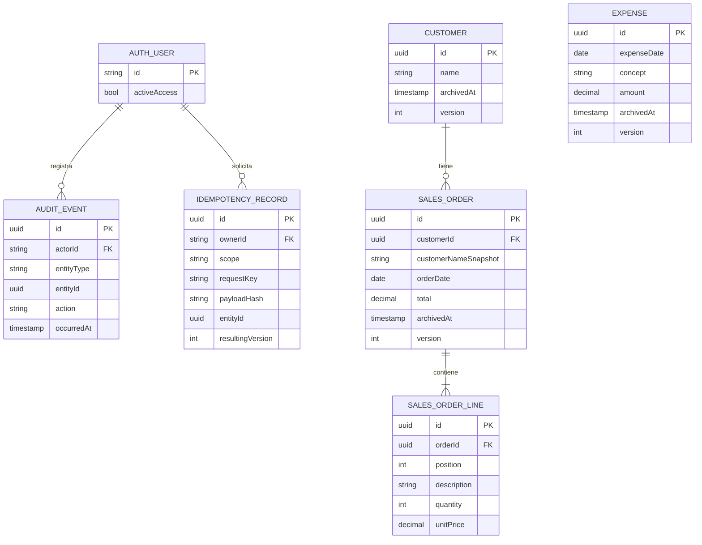

# Database Design — Lúmina

Status: APPROVED el 2026-09-30; schema y migración inicial ejecutables en prisma/. Migraciones/grants aplicados a Docker local y DB QA aislada; validaciones en QA_REPORT.md.
Author: database_architect, usando schema (`Model → Migrate → Validate`).
Inputs: [Requirements](REQUIREMENTS.md), [PRD](PRD.md), [Architecture](ARCHITECTURE.md) y [API](API_DESIGN.md).

## Alcance y decisiones

PostgreSQL con Prisma; una base compartida por los dueños del mismo negocio, sin tenants ni roles distintos.
Modelo relacional para clientes, pedidos, líneas y gastos. Sin inventario, pagos ni facturas desglosadas.
La moneda de todos los importes es COP; no se guarda un campo de moneda editable.
IDs del dominio: UUID generados por servidor; IDs de usuario y tablas de autenticación siguen los tipos generados por Better Auth.
Los nombres físicos evitarán palabras reservadas: `customers`, `sales_orders`, `sales_order_lines`, `expenses`, `audit_events`, `idempotency_records`.

Normalización por entidades y relaciones. El nombre histórico del cliente es un snapshot de negocio, no un duplicado que se sincronice con el cliente.
El total del pedido es una proyección persistida de sus líneas para consultas del dashboard; líneas son fuente del cálculo y se guardan con el total en una misma transacción.
Esta proyección no admite escritura desde el navegador; tests y revisión comprueban su igualdad con la suma de líneas.

El ER muestra únicamente el enlace a autenticación; Better Auth aporta sus tablas de usuarios, cuentas y sesiones con su schema oficial generado después del approval gate.
`AuditEvent.entityType/entityId` referencia lógicamente una de las tres entidades, validada por el servicio; no es una FK polimórfica inexistente.

## Diccionario de datos

En Customer, SalesOrder y Expense: `id` PK UUID, `createdAt/updatedAt` instantes UTC, `archivedAt` instante UTC nullable, `version` entero positivo inicialmente 1.
Una mutación confirmada de edición, archivo o restauración incrementa `version` una vez; nunca se admite la versión enviada como nuevo valor.
Campos opcionales vacíos se normalizan a null. Longitudes corresponden a caracteres, con validación consistente servidor/base.

| Entidad | Campos específicos y restricciones |
|---|---|
| Customer | `name` varchar(120), obligatorio no vacío tras trim; `contact` varchar(120) nullable; `notes` varchar(2000) nullable. Nombres repetidos permitidos. |
| SalesOrder | `orderDate` DATE obligatorio; `customerId` FK Customer obligatoria; `customerNameSnapshot` varchar(120) obligatorio; `notes` varchar(2000) nullable; `total` numeric(14,2) obligatorio, >0 y ≤999999999999.99. |
| SalesOrderLine | `id` PK UUID; `orderId` FK SalesOrder obligatoria; `position` entero 1–100; `description` varchar(200) no vacía tras trim; `quantity` entero 1–10000; `unitPrice` numeric(14,2), 0–999999999999.99. UNIQUE(orderId, position). |
| Expense | `expenseDate` DATE obligatorio; `concept` varchar(300) no vacío tras trim; `amount` numeric(14,2), >0 y ≤999999999999.99; `supplier` y `invoiceReference` varchar(120) nullable. |
| AuditEvent | `id` PK UUID; `actorId` FK AuthUser; `actorNameSnapshot` texto del nombre del dueño al actuar; `occurredAt` instante UTC servidor; `entityType` CUSTOMER/ORDER/EXPENSE; `entityId` UUID; `action` CREATE/UPDATE/ARCHIVE/RESTORE; `before/after` JSONB del dominio; `resultingVersion` entero positivo. CREATE tiene before null. |
| IdempotencyRecord | `id` PK UUID; `ownerId` FK AuthUser; `scope` identifica operación (por ejemplo orders.update); `requestKey` UUID según API; `payloadHash` SHA-256 de comando canónico; `entityType/entityId`, `resultingVersion`, `response` JSONB privada y `createdAt` UTC. UNIQUE(ownerId, scope, requestKey), equivalente al contrato actorUserId/operation/key. |

CHECKs de base: versiones positivas, posiciones/cantidades acotadas, texto obligatorio no vacío, importes finitos dentro de los límites. No usar float ni tipo money.
Los importes se reciben como string decimal canónico con punto y dos decimales; servidor valida antes de insertar, rechazando más de dos decimales, negativos, NaN e Infinity.
PostgreSQL redondea entradas que exceden la escala: por eso numeric(14,2) no reemplaza la validación de entrada. [Numeric Types](https://www.postgresql.org/docs/current/datatype-numeric.html).

Cada pedido contiene 1–100 líneas ordenadas. Cantidad × precio puede superar el límite aunque cada campo sea válido: calcular con Decimal de precisión suficiente, validar cada subtotal y la suma antes de escribir.
Subtotal se calcula, no se persiste por separado. Cero en una línea admite cortesía; suma cero invalida el pedido.
Las reglas de cardinalidad y suma entre tablas se garantizan en el único servicio transaccional de escritura y se verifican con tests de integración; no atribuirlas a CHECKs de fila.

## Relaciones, historial y archivo

Todas las FKs usan RESTRICT para borrado físico de clientes, pedidos y actores; la aplicación no ofrece borrado físico.
Archivar pedido conserva sus líneas. Al editar se reemplaza el conjunto de líneas dentro de la transacción; el snapshot de auditoría conserva líneas y orden anteriores.
Archivar cliente no modifica pedidos, nombres históricos ni resumen. Un pedido nuevo o cambio de cliente exige cliente activo.
Editar sin cambiar cliente y restaurar pedido permiten conservar un cliente archivado.
Crear o cambiar cliente toma el nombre del cliente elegido como snapshot; editar otros campos conserva el snapshot previo.
Editar Customer nunca reescribe snapshots ni precios de pedidos. Descripción y precio de cada línea pertenecen al pedido, con referencia opcional a catálogo; la descripción y el precio copiados siguen perteneciendo al pedido.
Solo registros activos admiten edición. ARCHIVE requiere activo y RESTORE requiere archivado, ambos con versión vigente.
Cliente, pedido y gasto comparten archivo/restauración, controles concurrentes y auditoría; no hay cascada de archivo ni restauración.

AuditEvent es append-only: los dueños solo consultan el historial, sin endpoints de edición/borrado. El rol DB de ejecución carece de UPDATE/DELETE sobre auditoría; migraciones usan credenciales separadas.
Snapshots comerciales incluyen nombre histórico, fechas, líneas ordenadas, importes, proveedor/referencia, version y archivedAt. Nunca incluyen textos de contacto o notas: guardan únicamente indicadores de los campos modificados. No se ofrece restaurar esos textos desde auditoría. La respuesta idempotente es mínima (id, versión, estado y total si corresponde), sin contactos, notas ni líneas; la UI consulta el registro actual después del éxito.
Nunca se copian contraseñas, hashes, tokens, cookies, secretos ni objetos completos de autenticación al audit o idempotencia.
Los snapshots contienen datos privados de clientes: se consultan con el mismo guard de autorización, sin volcarlos a logs.
No hay purga automática de datos de negocio, auditoría o idempotencia en el MVP. Si el alcance cambia, revisar retención con los dueños antes de introducir una política de eliminación.

## Transacciones, concurrencia e idempotencia

Cada mutación sigue el contrato API: autenticar sesión; validar/normalizar comando; iniciar transacción; bloquear AuthUser compartidamente y volver a comprobar activeAccess; serializar clave de idempotencia; validar estado y versión; escribir entidad/líneas; añadir audit; persistir resultado mínimo idempotente; commit; responder. Revocar acceso usa bloqueo exclusivo de la misma fila y revoca sesiones; no puede confirmar una escritura posterior a la revocación ganadora. Orden compartido: admisión del actor → clave → entidad objetivo → cliente asociado cuando corresponde. Reintentos acotados resuelven deadlocks sin omitir guard ni cambiar clave.
Una clave existente con hash igual devuelve su respuesta original tras comprobar acceso vigente; no repite mutación, auditoría ni incremento de versión, aunque el recurso haya cambiado después.
Misma clave con payload distinto devuelve IDEMPOTENCY_MISMATCH según API. El hash incluye comando normalizado, recurso, líneas en su orden y expectedVersion, excluyendo requestKey y requestId; cambiar recurso con la misma clave/operación también es mismatch.
La identidad de clave es ownerId+scope+requestKey; su clave UNIQUE arbitra dos solicitudes concurrentes. La implementación debe esperar/reconsultar el resultado de la transacción ganadora y comparar hash, sin continuar en una transacción abortada por unique violation.
Una transacción fallida no deja reserva, mutación, líneas parciales, audit ni resultado de idempotencia. El cliente conserva la clave al reintentar un resultado incierto por red.
Retención de idempotencia indefinida en el MVP, como el resto del historial; no implementar limpieza ni vencimiento que permita duplicados tras un reintento tardío.

UPDATE/ARCHIVE/RESTORE deben comparar atómicamente id+expectedVersion y estado esperado; cero filas afectadas produce NOT_FOUND o CONFLICT según API, sin datos parciales.
El before del audit se obtiene de la versión bloqueada/validada dentro de esa misma transacción, no de una lectura previa fuera de ella.
Crear/cambiar cliente bloquea la fila de Customer mientras valida que siga activo; archivar cliente adquiere un bloqueo incompatible, evitando la carrera entre selección y archivo.
La estrategia concreta usará transacción Prisma y bloqueos SQL parametrizados cuando necesarios; todos los servicios respetan orden consistente de bloqueos y reintentos acotados de deadlock/serialización con la misma clave. [PostgreSQL Explicit Locking](https://www.postgresql.org/docs/current/explicit-locking.html).

## Acceso y consultas

Better Auth genera su schema oficial y mapeo Prisma durante TECHNOLOGY_FINALIZATION/SCAFFOLD aprobados. No se diseña una tabla password propia.
AuthUser incorpora `activeAccess` para admitir únicamente dueños provisionados: valor inicial false, campo adicional Better Auth con input:false. No se acepta por API de navegador; solo el operador puede modificarlo. El servidor comprueba sesión y admisión vigente en toda consulta/mutación, incluido replay de idempotencia. El handler web expone únicamente rutas/métodos de login, logout y consulta de sesión de la allowlist documentada en ARCHITECTURE.md; bloquea alta y edición de usuario, recuperación y vinculación de cuentas. La instancia CLI no se importa al bundle web.
Registro público cerrado. Provisionamiento administrativo CLI interactivo, con contraseña oculta, sin contraseña por argumentos/logs ni dependencia SMTP. No se crean cuentas reales ni credenciales en seeds.
Las relaciones actor/owner permanecen tras revocar acceso; revocar no borra historial.

Fechas comerciales son DATE dateOnly: `YYYY-MM-DD` válido, conservado sin conversión de zona horaria. Timestamps técnicos son UTC; fecha inicial del dashboard usa America/Bogota.
Dashboard suma pedidos y gastos activos por sus fechas comerciales en rango inclusivo, independientemente del archivo del cliente.
Usar una única consulta o snapshot transaccional consistente para ambos sumatorios. Rango sin registros devuelve 0.00.
Las sumas agregadas y la diferencia usan Decimal/numeric sin cast a numeric(14,2): varias entidades válidas pueden sumar más que el máximo por registro.
La diferencia puede ser negativa; responde como string decimal y no representa utilidad contable ni dinero cobrado.

| Patrón | Índice inicial |
|---|---|
| Activos y archivados por fecha, paginación estable | SalesOrder(orderDate DESC, id DESC), Expense(expenseDate DESC, id DESC); índices parciales activos `archivedAt IS NULL` para dashboard/listado, revisar con carga real |
| Pedidos de un cliente | SalesOrder(customerId, orderDate DESC, id DESC) |
| Líneas del pedido | UNIQUE(orderId, position), cubre FK orderId |
| Lista clientes ordenada | Customer(name, id), filtrado de archivo |
| Historial de entidad | AuditEvent(entityType, entityId, occurredAt, id) |
| Relaciones de actor y dueño | AuditEvent(actorId); UNIQUE(ownerId, scope, requestKey) cubre ownerId de IdempotencyRecord |

Búsqueda por subcadena de nombre, sin distinguir mayúsculas, usa consulta parametrizada. B-tree no se presenta como acelerador de contains.
Con carga pequeña inicial puede usarse scan; medir requisito p95 con 1.000 pedidos/5 dueños concurrentes antes de proponer pg_trgm u otros índices.
Filtros de activos/archivados separados y paginación/tie-breaker según API. Sin particiones, caches o índices JSONB sin una consulta que los justifique.

## Operación y conexión Docker / Neon

Elección usuario 2026-09-30: desarrollo/test PostgreSQL Docker, producción Neon. Sin modificar modelo de datos. Prisma runtime Node usa PostgreSQL TCP con URL pooled Neon y rol restringido; transacciones interactivas y locks de fila duran hasta commit, sin driver HTTP stateless ni dependencia de estado de sesión. Migraciones/grants y pg_dump/pg_restore usan conexión directa con rol operador separado, nunca secreto del runtime. TLS con validación de certificado, secretos server-only. Ver contrato detallado y fuentes en TECHNOLOGY_STACK.md; fijar misma major soportada local/Neon y herramientas compatibles durante finalization. Restore en DB aislada reconstruye ownership/grants y verifica append-only de audit; staging Neon solo con datos sintéticos/credenciales autorizadas tras gate, nunca producción en QA. Plan/restore window/coste requieren validación antes activar; no cuentas ni conexiones realizadas.

## Migraciones, rollback y recuperación

Solo tras aprobación: generar tablas Auth y revisar mapeo; migración inicial Customer → SalesOrder → SalesOrderLine → Expense → AuditEvent/IdempotencyRecord y dependencias de Auth; aplicar constraints, índices y grants revisados.
Versionar schema y SQL de migraciones; revisar SQL generado. Probar creación sobre DB vacía y upgrade desde snapshot sintético.
Una migración inicial con datos reales no tiene down destructivo automático: requiere backup verificado y aprobación específica antes de DROP.
Rollback normal conserva datos y revierte aplicación sobre schema compatible; cambios futuros usan expand → backfill/validate → contract con revisión del impacto.
No tratar `prisma migrate resolve --rolled-back` como undo: marca estado de una migración fallida, no revierte SQL ya aplicado. [Prisma failed migrations](https://www.prisma.io/docs/orm/v7/prisma-migrate/workflows/patching-and-hotfixing).
En producción establecer lock_timeout/statement_timeout mediante configuración de rol aprobada por conexión directa o configuración transaccional compatible verificada; no depender de SET de sesión persistente en el pooler. Crear índices concurrentemente cuando tabla poblada lo requiera, fuera de bloques transaccionales incompatibles y por conexión directa. Sin DDL productivo durante blueprint.
La revisión de migraciones usa linter de DDL o equivalente y evidencia de locks, integridad y rollback antes de deploy.

Seed exclusivo de desarrollo: dos usuarios ficticios provisionados mediante Auth, clientes sintéticos, pedidos multilínea, cortesía, gastos, casos activos/archivados e historial coherente; sin PII ni credenciales reales.
Backup: pg_dump cifrado fuera del repo; secretos fuera de comandos/logs y sin sobrescribir copias verificadas. Antes de producción documentar frecuencia, retención, ubicación y operador con base en hosting/coste aprobados.
Probar restauración en base aislada sin conectar la app productiva; comparar conteos, FKs, totales e historial. Registrar evidencia sin volcar contactos ni secretos.

## Validación y handoff

Revisión requerida: arquitectura/data y QA independientes; este documento no afirma schema compilado, migraciones aplicadas ni tests ejecutados.
Casos críticos: FK y bounds; varias líneas/decimal exacto/cero; overflow por multiplicación/suma; fecha sin desplazamiento; rollback sin audit parcial; replay concurrente y hash distinto; versión obsoleta; cliente archivado en create/change versus edit/restore; snapshot inmutable; archivo/restauración y dashboard; acceso revocado; restore de backup.
backend_developer recibe entidades, invariantes y transacciones mediante los skills builder/gateway; test_generator recibe casos críticos mediante radar; nexus integra revisión y approval gate.
No se detectan preguntas de producto bloqueantes; los límites y políticas son propuestas revisables del blueprint, no nuevas declaraciones del usuario.

## Extensión aprobada — 2026-10-01

El usuario aprobó implementar catálogo sin inventario, selección integrada de clientes/productos, pedidos compactos, listados más claros y evolución de pedidos/gastos/diferencia. La exclusión inicial del catálogo queda sustituida por esta autorización; las líneas libres siguen admitidas. Contratos, responsables, dependencias y aceptación: [IMPROVEMENTS_PLAN.md](IMPROVEMENTS_PLAN.md). Misma arquitectura y reglas de integridad/acceso; migración aditiva e histórico preservado.

Modelo Product UUID/name120/price numeric(14,2) positivo/description2000 opcional/archivedAt/version/timestamps. Índice archivedAt,name,id. SalesOrderLine.productId nullable con FK RESTRICT; registros históricos quedan null. Audit constraint agrega PRODUCT. Runtime SELECT/INSERT/UPDATE products, sin DELETE/TRUNCATE; operador de cuentas no recibe permisos comerciales nuevos. Referencias a producto archivado no pueden aumentar el número previo de líneas vinculadas a ese producto dentro del mismo pedido.

## LUM-21 — Alta pública

Migración aditiva202610010006_public_registration: public_registration_limit de una fila booleantrue, attempt_window timestamptz y attempts. Runtime no tiene acceso directo a esta tabla; EXECUTE reserve_public_registration_attempt() y register_owner_account(text,text,text,text), funciones del migrador SECURITY DEFINER con search_path fijo/PUBLIC revocado. Reserva global5/min; user+credential account atómicos con activeAccesstrue; unique_violation revierte ambos. Modelos comerciales sin cambios; latch de primera cuenta sigue cerrado después de un alta.
